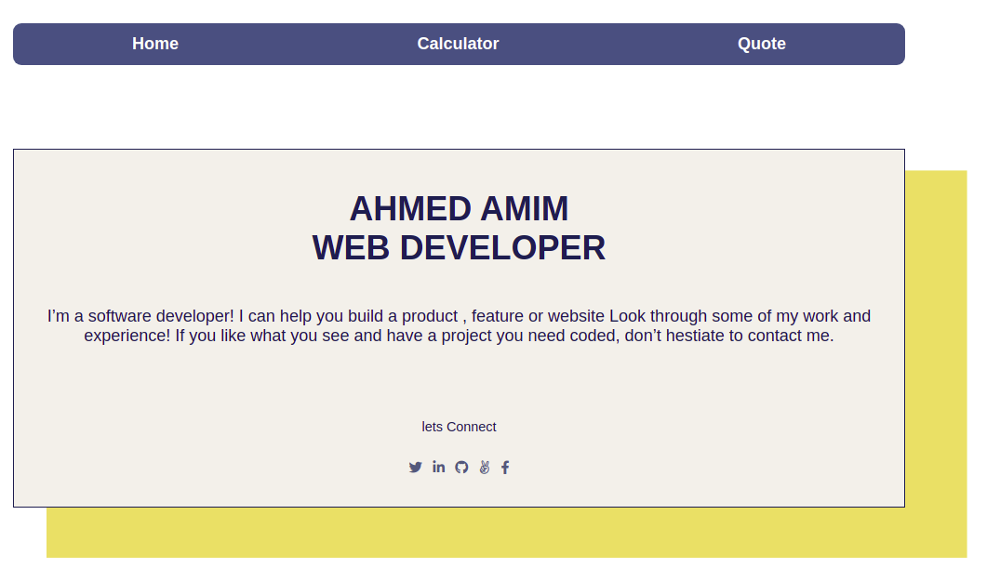
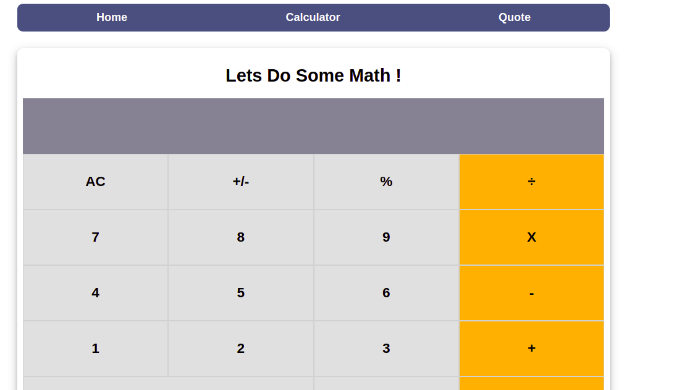
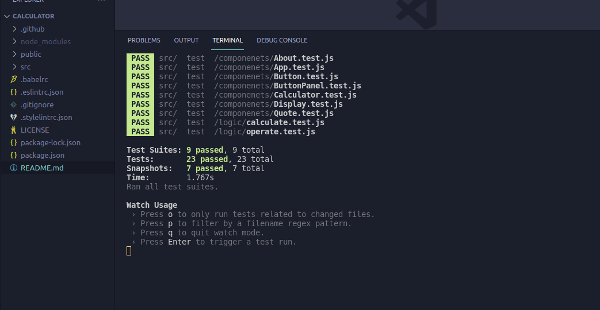

# Calculator App

This project is a simple Calculator built with React.

 

I built this app on 5 Milestones:

## First Milestone:
This is the first milestone in the calculator app. I added the required packages and linters and deployed it to Heroku.

## Second Milestone:
In this milestone I added the 3 main component (Display , ButtonPanel and Button).
1. Display Component with result prop (String) and it is default value is 0.
2. Button with name prop (String).
3. ButtonPanel which render the calculator panel (Button components) with all the buttons in 5 groups.

## Fourth Milestone:
In this milestone I added two logic files: calculate and operate files.
1. Calculate: It contains one default method: calculate. The calculate method accepts a calculator data object and a button name as arguments. The calculator data object contains three properties: total, next and operation.
Calculate method uses the buttonName argument to mutate the calculator’s data object and return its modified version. 

2. Operate: It contains one default method: operate. The operate function accepts numberOne, numberTwo and operation as arguments.By using the value of the operation argument, this method performs a simple math operation.

## Fifth Milestone:
In this milestone I applied the logic files to my app.
1. I added state on App file.
2. I passes the props from parents files to child files.
3. I handled the functionality of the app by click event.

## Style Milestone:

1. I added the style of my application to be with the required style.

 


# Live Link:
[Live Link](https://dry-crag-03357.herokuapp.com/)

# Built With
- JavaScript
- React

 
## Setup

1. To run this project locally, please ensure you have npm installed.
2. Open the terminal.
3. Clone this repository by running:

```bash
git clone https://github.com/AhmedAmin90/Calculator-app-react/
```

4. To install the dependencies Open your terminal at the project folder: 

```bash
npm install
```

5. Start the server :

```bash
npm start
```

# How to Test:

1. Open the terminal and run:

```bash
npm run test
```

 


## Authors

👤 **Ahmed Amin**

- GitHub: [@AhmedAmin90](https://github.com/AhmedAmin90)
- Twitter: [@AhmedAmin12383](https://twitter.com/AhmedAmin12383)
- LinkedIn: [Ahmed Amin](https://www.linkedin.com/in/web-developer/)


## 🤝 Contributing

Contributions, issues, and feature requests are welcome!

Feel free to check the [issues page]((https://github.com/AhmedAmin90/Calculator-app-react/issues)).

## Show your support

Give a ⭐️ if you like this project!

## License
<p>This project is <a href="./LICENSE">MIT</a> licensed.</p>